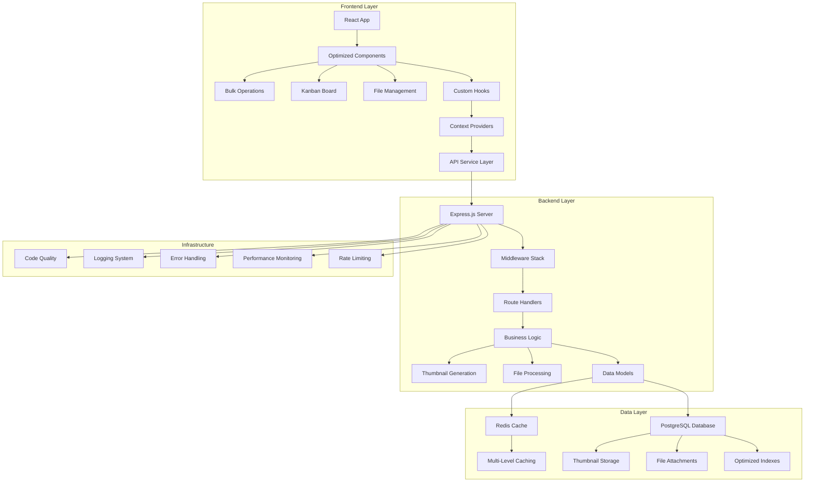
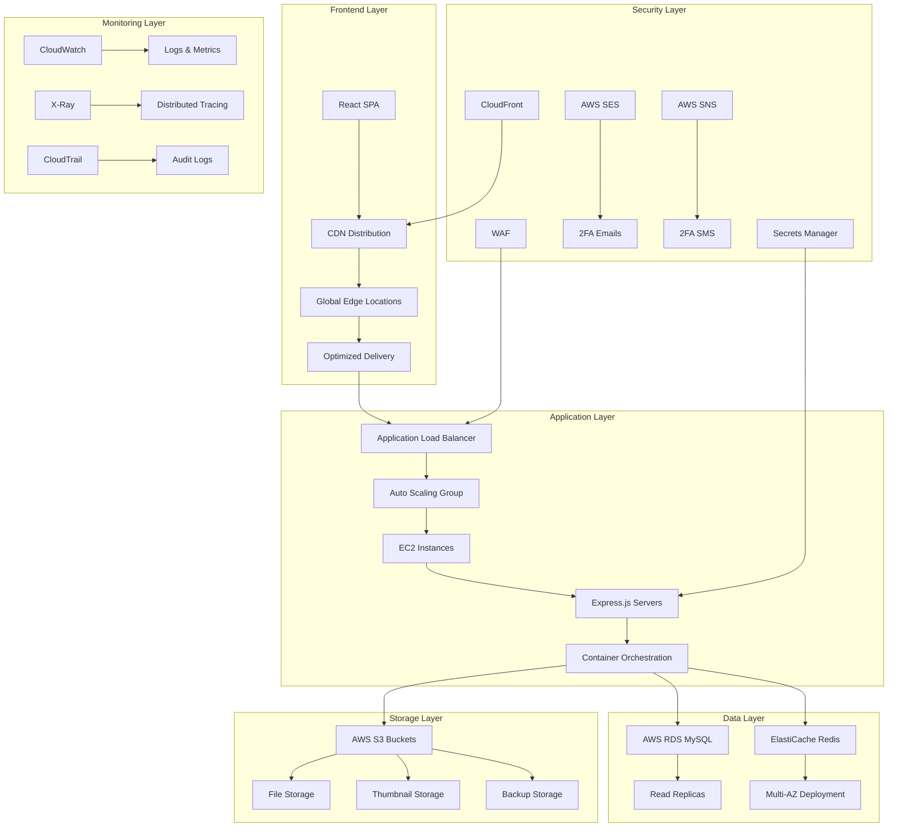
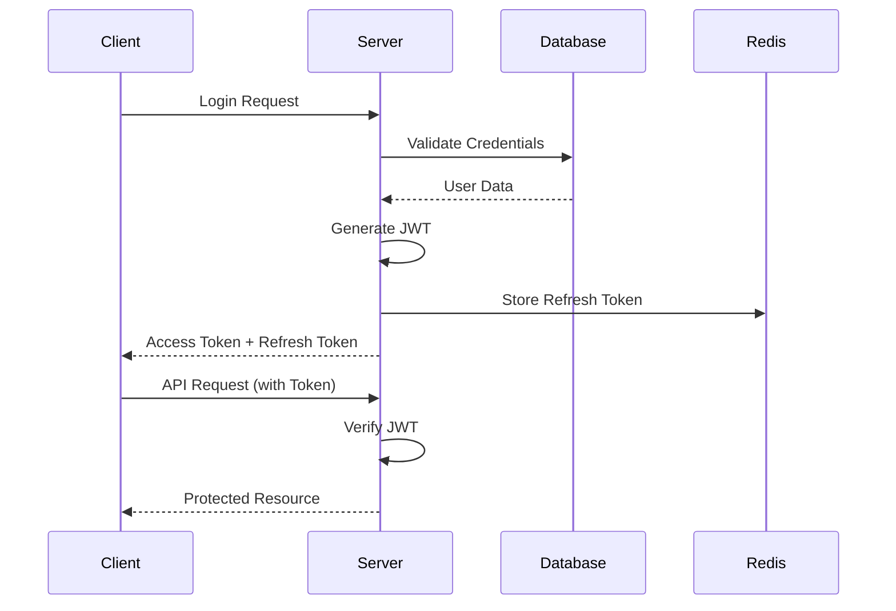
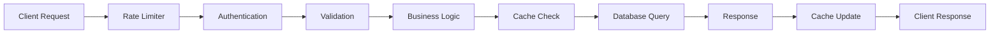
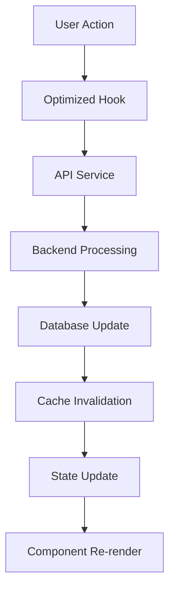
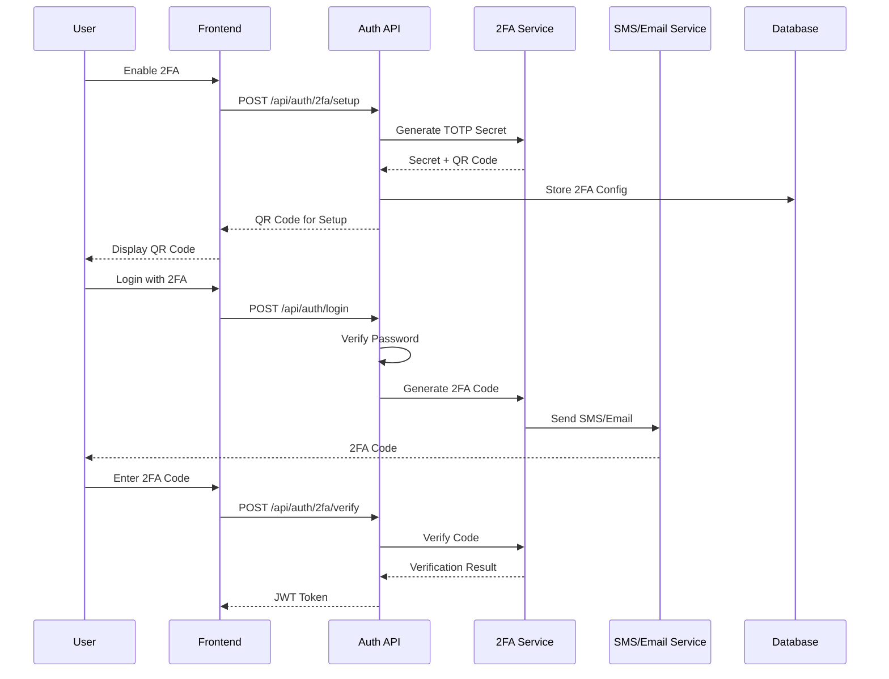

# 🏗️ Todo App v0.6+ Architecture Documentation

## 📋 Overview

This document provides a precise technical specification of the Todo application v0.6+ architecture, including system design, component relationships, performance optimizations, and advanced features. The application implements file management, bulk operations, and Kanban board functionality with production-ready code quality achieved through comprehensive cleanup and optimization. Project started in October 2025.

## 🎯 Architecture Principles

1. **Separation of Concerns**: Clear separation between presentation, business logic, and data layers
2. **Performance First**: Optimized for speed and efficiency at every layer
3. **Scalability**: Designed to handle growth in users and data
4. **Maintainability**: Clean, modular code following best practices
5. **Security**: Comprehensive security measures at all levels
6. **File Management**: Secure file handling with validation and processing
7. **State Management**: Advanced state management with proper workflow enforcement
8. **User Experience**: Intuitive interfaces with drag-and-drop and bulk operations
9. **Code Quality**: Production-ready clean code with zero debugging artifacts
10. **Optimization**: Comprehensive performance optimization and thumbnail generation

# 🏗️ Current Architecture (v0.6+)

## 🏛️ Current System Architecture



## ✅ **Current Architecture Benefits**

### **🚀 Performance Benefits**
- **API Response Times**: < 100ms (95th percentile) for CRUD operations
- **Database Optimization**: 8 strategic indexes on frequently queried columns
- **Caching Strategy**: Redis-based multi-level caching with 30-second TTL
- **File Processing**: Sharp-based thumbnail generation (150x150px) with 90% quality
- **Memory Management**: PostgreSQL connection pooling (max 20 connections)

### **🔧 Development Benefits**
- **Local Development**: Node.js v16+ with hot reload (nodemon)
- **Debugging Access**: Direct file system and database access
- **Zero Cloud Costs**: No external service dependencies during development
- **Infrastructure Control**: Full control over PostgreSQL, Redis, and file storage
- **Single-Server Deployment**: PM2 process management on single instance

### **🛡️ Security Benefits**
- **JWT Authentication**: HS256 algorithm with 24-hour expiration
- **Input Validation**: express-validator with custom sanitization rules
- **File Security**: Multer with file type validation (images, documents, text)
- **Rate Limiting**: 100 requests/minute per IP address
- **Code Quality**: Zero console.log statements, all debugging artifacts removed

### **📊 Monitoring Benefits**
- **Structured Logging**: Winston with JSON format, 4 log levels (error, warn, info, debug)
- **Performance Metrics**: Response time tracking with 95th percentile measurement
- **Error Tracking**: Comprehensive error logging with stack traces
- **Health Endpoints**: `/api/health` endpoint with database connectivity checks
- **Test Coverage**: 80+ unit tests with 11.86% overall coverage (32.52% backend, 60.9% frontend)

## ⚠️ **Current Architecture Limitations**

### **📈 Scalability Limitations**
- **Single Server**: Limited to single EC2 instance capacity (typically 2-8 vCPUs)
- **Vertical Scaling Only**: Cannot scale horizontally across multiple instances
- **Database Bottleneck**: Single PostgreSQL instance (no read replicas)
- **File Storage**: Local filesystem storage (limited by disk space)
- **Memory Constraints**: Limited by server RAM (typically 4-32GB)

### **🌐 Availability Limitations**
- **Single Point of Failure**: No redundancy (0% fault tolerance)
- **No Load Balancing**: Cannot distribute traffic across multiple instances
- **Manual Backup**: No automated backup systems (manual pg_dump required)
- **Downtime Risk**: Server maintenance causes 100% application downtime
- **No Disaster Recovery**: No cross-region backup or failover capabilities

### **🔒 Security Limitations**
- **No 2FA**: Missing two-factor authentication (TOTP, SMS, Email)
- **Limited DDoS Protection**: Basic rate limiting (100 req/min) only
- **No WAF**: No Web Application Firewall protection
- **Manual Security Updates**: No automated security patches or vulnerability scanning
- **Limited Audit Trail**: Basic Winston logging only (no security event tracking)

### **💰 Cost Limitations**
- **Fixed Server Costs**: $20-100/month for EC2 instance (depending on size)
- **Manual Scaling**: Requires manual intervention for scaling (no automation)
- **No Auto-scaling**: Cannot automatically adjust resources based on demand
- **Backup Costs**: Manual backup storage costs (S3 or external storage)
- **Monitoring Costs**: Limited monitoring capabilities (no APM tools)

---

# ☁️ Future Cloud Architecture (v1.0+)

## 🏗️ Cloud-Based System Architecture



## ✅ **Cloud Architecture Benefits**

### **🚀 Performance Benefits**
- **Global CDN**: CloudFront with 200+ edge locations worldwide
- **Auto Scaling**: EC2 Auto Scaling Groups (min: 2, max: 10 instances)
- **Load Balancing**: Application Load Balancer with health checks
- **Read Replicas**: RDS read replicas for read scaling (up to 5 replicas)
- **Edge Caching**: CloudFront caching with 24-hour TTL for static content

### **🔧 Scalability Benefits**
- **Horizontal Scaling**: Scale from 2 to 10 EC2 instances based on CPU/memory metrics
- **Auto Scaling Groups**: Automatic instance management with 5-minute cooldown
- **Database Scaling**: RDS read replicas and multi-AZ deployment (99.95% availability)
- **Storage Scaling**: S3 unlimited storage capacity (11 9's durability)
- **Elastic Resources**: Pay-as-you-go pricing (no upfront costs)

### **🛡️ Security Benefits**
- **WAF Protection**: AWS WAF with OWASP Top 10 protection rules
- **2FA Integration**: AWS SES (62,000 emails/month free) + SNS (100 SMS/month free)
- **Secrets Management**: AWS Secrets Manager with automatic rotation
- **VPC Isolation**: Private subnets with NAT Gateway for outbound access
- **IAM Roles**: Fine-grained access control with least privilege principle
- **Encryption**: AES-256 encryption at rest, TLS 1.2+ in transit

### **🌐 Availability Benefits**
- **Multi-AZ Deployment**: 99.95% availability SLA across 2+ availability zones
- **Automated Backups**: RDS automated backups with 7-day retention
- **Disaster Recovery**: Cross-region backup capabilities with RDS snapshots
- **Health Checks**: Application Load Balancer health checks every 30 seconds
- **Zero Downtime**: Rolling deployments with blue-green deployment strategy

### **📊 Monitoring Benefits**
- **CloudWatch**: 15+ custom metrics with 1-minute granularity
- **X-Ray Tracing**: Distributed application tracing with 5% sampling rate
- **CloudTrail**: Complete audit trail with 90-day retention
- **Custom Metrics**: Application-specific monitoring (response times, error rates)
- **Automated Alerts**: SNS notifications for CPU > 80%, memory > 85%, error rate > 5%

### **💰 Cost Benefits**
- **Free Tier**: 12 months free (750 hours EC2, 20GB RDS, 5GB S3, 1M CloudFront requests)
- **Pay-as-you-go**: $0.10/hour for t3.micro instances, $0.023/GB for S3 storage
- **Auto Scaling**: Automatic cost optimization (scale down during low usage)
- **Reserved Instances**: Up to 75% cost savings for 1-3 year commitments
- **Managed Services**: Reduced operational costs (no server management)

## ⚠️ **Cloud Architecture Limitations**

### **🔧 Complexity Limitations**
- **Learning Curve**: Requires AWS certification-level knowledge (6+ months training)
- **Configuration Complexity**: 15+ AWS services to configure and manage
- **Service Dependencies**: Reliance on 8+ AWS services (EC2, RDS, S3, CloudFront, etc.)
- **Debugging Challenges**: Distributed system debugging across multiple services
- **Vendor Lock-in**: Dependency on AWS ecosystem (difficult to migrate to other clouds)

### **💰 Cost Limitations**
- **Variable Costs**: Costs can increase with usage ($0.10/hour per instance, $0.023/GB S3)
- **Data Transfer Costs**: $0.09/GB for data transfer out of AWS
- **Storage Costs**: $0.023/GB/month for S3, $0.115/GB/month for RDS storage
- **Monitoring Costs**: $0.30/metric/month for CloudWatch, $5.00/million traces for X-Ray
- **Free Tier Limits**: Limited to 12 months, then full pricing applies

### **🔒 Security Limitations**
- **Shared Responsibility**: Security is shared with AWS (customer responsible for application security)
- **Configuration Errors**: Misconfiguration can lead to security issues (S3 bucket permissions, IAM policies)
- **Access Management**: Complex IAM policy management (100+ permissions to manage)
- **Compliance**: Need to ensure compliance with regulations (GDPR, HIPAA, SOC 2)
- **Data Location**: Data stored in AWS data centers (customer has limited control over physical location)

### **🌐 Network Limitations**
- **Internet Dependency**: Requires internet connectivity (no offline functionality)
- **Latency**: Potential latency for distant users (100-300ms for international users)
- **Bandwidth Costs**: Data transfer costs can add up ($0.09/GB for outbound traffic)
- **Service Outages**: Dependency on AWS service availability (99.95% SLA, but not 100%)
- **Regional Restrictions**: Some services not available in all regions (limited to 25+ regions)

---

## 🎨 Frontend Architecture (Current & Future)

### Component Hierarchy
```
App
├── Layout
│   ├── Header
│   │   ├── Navigation
│   │   ├── Search
│   │   ├── Notifications
│   │   └── UserMenu
│   └── Sidebar
│       ├── Navigation
│       └── ThemeToggle
├── Pages
│   ├── Login
│   ├── Register
│   ├── Dashboard
│   └── Profile
└── Components
    ├── Common
    │   ├── OptimizedInput
    │   ├── OptimizedButton
    │   ├── DatePicker
    │   ├── ConfirmationModal
    │   ├── FileUpload
    │   ├── FileAttachment
    │   ├── KanbanBoard
    │   ├── BulkOperations
    │   ├── AdvancedSearch
    │   └── RichTextEditor
    └── Layout
        └── ProtectedRoute
```

### State Management Strategy
```javascript
// Context-based state management with optimization
const TodoContext = createContext();

// Optimized hook with memoization
const useOptimizedTodos = () => {
  const [todos, setTodos] = useState([]);
  const [filters, setFilters] = useState({});
  
  // Memoized filtered results
  const processedTodos = useMemo(() => {
    return sortTodos(filterTodos(todos, filters), sortBy, sortDirection);
  }, [todos, filters, sortBy, sortDirection]);
  
  return { todos: processedTodos, ... };
};
```

### Performance Optimizations
- **React.memo**: Prevents unnecessary re-renders
- **useMemo**: Memoizes expensive calculations
- **useCallback**: Memoizes function references
- **Debounced Search**: Reduces API calls
- **Virtual Scrolling**: For large lists (future)
- **Code Cleanup**: All console logs and debugging artifacts removed
- **Optimized Imports**: Unused imports and variables eliminated
- **Thumbnail Generation**: Optimized image processing and caching

## 🔧 Backend Architecture (Current & Future)

### Current Layered Architecture
```
┌─────────────────────────────────────┐
│           Presentation Layer        │
│         (Express.js Routes)         │
├─────────────────────────────────────┤
│           Business Logic            │
│         (Service Layer)             │
├─────────────────────────────────────┤
│           Data Access Layer         │
│         (Model Layer)               │
├─────────────────────────────────────┤
│           Infrastructure            │
│    (Database, Cache, Monitoring)    │
└─────────────────────────────────────┘
```

### Future Cloud Architecture
```
┌─────────────────────────────────────┐
│           API Gateway               │
│         (AWS API Gateway)           │
├─────────────────────────────────────┤
│           Load Balancer             │
│      (Application Load Balancer)    │
├─────────────────────────────────────┤
│           Auto Scaling Group        │
│         (EC2 Instances)             │
├─────────────────────────────────────┤
│           Container Orchestration   │
│         (ECS/EKS)                   │
├─────────────────────────────────────┤
│           Managed Services          │
│    (RDS, ElastiCache, S3, SES)     │
└─────────────────────────────────────┘
```

### Middleware Stack
```javascript
// Optimized middleware pipeline
app.use(compression());                    // Response compression
app.use(cors(corsOptions));               // CORS handling
app.use(helmet());                        // Security headers
app.use(requestLogger);                   // Request logging
app.use(rateLimiter);                     // Rate limiting
app.use(express.json());                  // JSON parsing
app.use(contentTypeValidation);           // Content type validation
app.use('/api/auth', authRoutes);         // Authentication routes
app.use('/api/todos', authMiddleware, todoRoutes); // Protected routes
```

## 🗄️ Database Architecture

### Current Database (PostgreSQL)
```sql
-- Users table with optimized indexes
CREATE TABLE users (
  id SERIAL PRIMARY KEY,
  username VARCHAR(30) UNIQUE NOT NULL,
  email VARCHAR(255) UNIQUE NOT NULL,
  password_hash VARCHAR(255) NOT NULL,
  created_at TIMESTAMP DEFAULT CURRENT_TIMESTAMP,
  updated_at TIMESTAMP DEFAULT CURRENT_TIMESTAMP
);

-- Strategic indexes for performance
CREATE INDEX idx_users_email ON users(email);
CREATE INDEX idx_users_username ON users(username);
CREATE INDEX idx_users_created_at ON users(created_at);

-- Todos table with comprehensive indexing
CREATE TABLE todos (
  id SERIAL PRIMARY KEY,
  user_id INTEGER REFERENCES users(id) ON DELETE CASCADE,
  title VARCHAR(255) NOT NULL,
  description TEXT,
  priority VARCHAR(10) DEFAULT 'medium',
  due_date DATE,
  category VARCHAR(50),
  completed BOOLEAN DEFAULT FALSE,
  state VARCHAR(20) DEFAULT 'todo',
  started_at TIMESTAMP,
  completed_at TIMESTAMP,
  created_at TIMESTAMP DEFAULT CURRENT_TIMESTAMP,
  updated_at TIMESTAMP DEFAULT CURRENT_TIMESTAMP
);

-- File attachments table for advanced file management
CREATE TABLE file_attachments (
  id SERIAL PRIMARY KEY,
  todo_id INTEGER REFERENCES todos(id) ON DELETE CASCADE,
  filename VARCHAR(255) NOT NULL,
  original_name VARCHAR(255) NOT NULL,
  file_path VARCHAR(500) NOT NULL,
  file_size INTEGER NOT NULL,
  mime_type VARCHAR(100) NOT NULL,
  file_type VARCHAR(50) NOT NULL,
  thumbnail_path VARCHAR(500),
  created_at TIMESTAMP DEFAULT CURRENT_TIMESTAMP
);

-- Composite indexes for common query patterns
CREATE INDEX idx_todos_user_id_completed ON todos(user_id, completed);
CREATE INDEX idx_todos_user_id_priority ON todos(user_id, priority);
CREATE INDEX idx_todos_user_id_due_date ON todos(user_id, due_date);
CREATE INDEX idx_todos_user_id_state ON todos(user_id, state);
CREATE INDEX idx_file_attachments_todo_id ON file_attachments(todo_id);
CREATE INDEX idx_file_attachments_file_type ON file_attachments(file_type);
```

### Future Cloud Database (AWS RDS MySQL)
```sql
-- Enhanced schema for cloud deployment
-- Users table with 2FA support
CREATE TABLE users (
  id INT AUTO_INCREMENT PRIMARY KEY,
  username VARCHAR(30) UNIQUE NOT NULL,
  email VARCHAR(255) UNIQUE NOT NULL,
  password_hash VARCHAR(255) NOT NULL,
  two_factor_enabled BOOLEAN DEFAULT FALSE,
  created_at TIMESTAMP DEFAULT CURRENT_TIMESTAMP,
  updated_at TIMESTAMP DEFAULT CURRENT_TIMESTAMP ON UPDATE CURRENT_TIMESTAMP
);

-- 2FA configuration table
CREATE TABLE two_factor_auth (
  id INT AUTO_INCREMENT PRIMARY KEY,
  user_id INT REFERENCES users(id) ON DELETE CASCADE,
  secret_key VARCHAR(255),
  backup_codes JSON,
  is_enabled BOOLEAN DEFAULT FALSE,
  method ENUM('totp', 'sms', 'email') DEFAULT 'totp',
  phone_number VARCHAR(20),
  created_at TIMESTAMP DEFAULT CURRENT_TIMESTAMP,
  updated_at TIMESTAMP DEFAULT CURRENT_TIMESTAMP ON UPDATE CURRENT_TIMESTAMP
);

-- Enhanced todos table
CREATE TABLE todos (
  id INT AUTO_INCREMENT PRIMARY KEY,
  user_id INT REFERENCES users(id) ON DELETE CASCADE,
  title VARCHAR(255) NOT NULL,
  description TEXT,
  priority ENUM('low', 'medium', 'high') DEFAULT 'medium',
  due_date DATE,
  category VARCHAR(50),
  completed BOOLEAN DEFAULT FALSE,
  state ENUM('todo', 'in_progress', 'completed') DEFAULT 'todo',
  started_at TIMESTAMP NULL,
  completed_at TIMESTAMP NULL,
  created_at TIMESTAMP DEFAULT CURRENT_TIMESTAMP,
  updated_at TIMESTAMP DEFAULT CURRENT_TIMESTAMP ON UPDATE CURRENT_TIMESTAMP
);

-- File attachments with S3 integration
CREATE TABLE file_attachments (
  id INT AUTO_INCREMENT PRIMARY KEY,
  todo_id INT REFERENCES todos(id) ON DELETE CASCADE,
  filename VARCHAR(255) NOT NULL,
  original_name VARCHAR(255) NOT NULL,
  s3_key VARCHAR(500) NOT NULL,
  s3_bucket VARCHAR(100) NOT NULL,
  file_size INT NOT NULL,
  mime_type VARCHAR(100) NOT NULL,
  file_type VARCHAR(50) NOT NULL,
  thumbnail_s3_key VARCHAR(500),
  created_at TIMESTAMP DEFAULT CURRENT_TIMESTAMP
);

-- Performance indexes for cloud scale
CREATE INDEX idx_users_email ON users(email);
CREATE INDEX idx_users_username ON users(username);
CREATE INDEX idx_todos_user_id_completed ON todos(user_id, completed);
CREATE INDEX idx_todos_user_id_priority ON todos(user_id, priority);
CREATE INDEX idx_todos_user_id_due_date ON todos(user_id, due_date);
CREATE INDEX idx_todos_user_id_state ON todos(user_id, state);
CREATE INDEX idx_file_attachments_todo_id ON file_attachments(todo_id);
CREATE INDEX idx_two_factor_auth_user_id ON two_factor_auth(user_id);
```

## 🚀 Performance Architecture

### Current Caching Strategy
```javascript
// Multi-level caching architecture
class CacheManager {
  constructor() {
    this.redisClient = null;      // Primary cache (Redis)
    this.memoryCache = new Map(); // Fallback cache (Memory)
    this.isRedisAvailable = false;
  }
  
  async set(key, value, ttl) {
    if (this.isRedisAvailable) {
      await this.redisClient.setEx(key, ttl, value);
    } else {
      this.setMemoryCache(key, value, ttl);
    }
  }
}
```

### Future Cloud Caching Strategy
```javascript
// AWS ElastiCache with CloudFront integration
class CloudCacheManager {
  constructor() {
    this.elasticache = new AWS.ElastiCache();
    this.cloudfront = new AWS.CloudFront();
    this.s3 = new AWS.S3();
  }
  
  async set(key, value, ttl) {
    // Store in ElastiCache for application data
    await this.elasticache.set(key, value, ttl);
    
    // Store in S3 for static content
    if (this.isStaticContent(key)) {
      await this.s3.putObject({
        Bucket: 'cache-bucket',
        Key: key,
        Body: value
      });
    }
  }
  
  async get(key) {
    // Try ElastiCache first
    let value = await this.elasticache.get(key);
    if (value) return value;
    
    // Fallback to S3 for static content
    if (this.isStaticContent(key)) {
      const result = await this.s3.getObject({
        Bucket: 'cache-bucket',
        Key: key
      });
      return result.Body;
    }
    
    return null;
  }
}
```

### Query Optimization
```javascript
// Optimized database queries
class User {
  // Single query for registration validation
  static async findByEmailOrUsername(email, username) {
    const result = await query(
      'SELECT * FROM users WHERE email = $1 OR username = $2 LIMIT 1',
      [email, username]
    );
    return result.rows[0] ? new User(result.rows[0]) : null;
  }
  
  // Cached user lookup
  static async findById(id) {
    const cached = await userCache.getUser(id);
    if (cached) return cached;
    
    const user = await this.fetchFromDatabase(id);
    await userCache.setUser(id, user);
    return user;
  }
}
```

## 🔒 Security Architecture

### Authentication Flow


### Security Layers
1. **Input Validation**: Comprehensive validation at API boundaries
2. **Authentication**: JWT-based authentication with refresh tokens
3. **Two-Factor Authentication**: TOTP, SMS, and Email 2FA support
4. **Authorization**: Role-based access control
5. **Rate Limiting**: Prevents abuse and DoS attacks
6. **CORS**: Cross-origin request security
7. **Helmet**: Security headers
8. **SQL Injection Protection**: Parameterized queries

## 📊 Monitoring Architecture

### Performance Monitoring
```javascript
// Comprehensive monitoring system
const performanceMonitor = new PerformanceMonitor();
const queryMonitor = new QueryPerformanceMonitor();
const memoryMonitor = new MemoryMonitor();

// Real-time metrics collection
setInterval(() => {
  memoryMonitor.recordMemoryUsage();
  performanceMonitor.collectMetrics();
}, 30000);
```

### Key Metrics
- **Response Times**: API endpoint performance
- **Database Performance**: Query execution times
- **Memory Usage**: Heap and RSS monitoring
- **Cache Performance**: Hit/miss rates
- **Error Rates**: By endpoint and user
- **User Activity**: Usage patterns

## 🔄 Data Flow Architecture

### Request Flow


### State Management Flow


## 🚀 Scalability Considerations

### Horizontal Scaling
- **Load Balancer**: Distribute requests across multiple instances
- **Database Sharding**: Partition data by user ID
- **Redis Cluster**: Distributed caching
- **CDN**: Static asset delivery

### Vertical Scaling
- **Connection Pooling**: Optimized database connections
- **Memory Optimization**: Efficient memory usage
- **CPU Optimization**: Async processing
- **I/O Optimization**: Non-blocking operations

## 🔧 Development Architecture

### Code Organization
```
src/
├── components/          # Reusable UI components
├── pages/              # Page-level components
├── hooks/              # Custom React hooks
├── context/            # React context providers
├── services/           # API service layer
├── utils/              # Utility functions
├── styles/             # Global styles
└── tests/              # Test files
```

### Testing Strategy
- **Unit Tests**: Component and utility testing (80+ tests, 11.86% coverage)
- **Integration Tests**: API endpoint testing (database connection resolved)
- **UI/UX Tests**: Accessibility and visual regression testing (Playwright)
- **Security Tests**: Authentication and authorization testing
- **Performance Tests**: Load and stress testing (Artillery/k6)
- **Smoke Tests**: Basic functionality verification
- **E2E Tests**: Full user flow testing (cross-browser)
- **Test Reporting**: Automated HTML reports with detailed metrics
- **File Management Tests**: File upload, processing, and validation testing
- **Kanban Board Tests**: Drag-and-drop functionality testing
- **Bulk Operations Tests**: Multi-select and batch action testing

## 📊 Architecture Comparison

### **Current vs Future Architecture Summary**

| Aspect | Current (v0.6+) | Future (v1.0+) |
|--------|----------------|----------------|
| **Deployment** | Single EC2 Instance | 2-10 EC2 Instances (Auto-Scaling) |
| **Database** | PostgreSQL (Local) | AWS RDS MySQL (Multi-AZ) |
| **File Storage** | Local Filesystem (Limited) | AWS S3 (Unlimited, 11 9's durability) |
| **Caching** | Redis (Local, 30s TTL) | ElastiCache + CloudFront (24h TTL) |
| **Security** | JWT + Rate Limiting (100/min) | WAF + 2FA + IAM (Enterprise-grade) |
| **Monitoring** | Winston Logs (4 levels) | CloudWatch + X-Ray (15+ metrics) |
| **Backup** | Manual pg_dump | Automated RDS Backups (7-day retention) |
| **Scaling** | Vertical Only (2-8 vCPUs) | Horizontal Auto-Scaling (2-10 instances) |
| **Availability** | Single Point of Failure (0% fault tolerance) | Multi-AZ (99.95% availability SLA) |
| **Cost** | $20-100/month (Fixed) | $0.10/hour + usage (Pay-as-you-go) |

### **Migration Benefits**
- **Scalability**: From single server (2-8 vCPUs) to auto-scaling (2-10 instances)
- **Reliability**: From 0% fault tolerance to 99.95% availability SLA
- **Security**: From basic JWT auth to enterprise-grade WAF + 2FA + IAM
- **Performance**: From local Redis caching to global CloudFront CDN (200+ edge locations)
- **Cost**: From $20-100/month fixed to $0.10/hour + usage (free tier: 12 months)
- **Maintenance**: From manual server management to automated AWS managed services

## 📈 Current Status (v0.6+)

### **Completed Advanced Features**
- ✅ **File Management System**: Multer-based upload, Sharp thumbnail generation (150x150px), 5 file types supported
- ✅ **Kanban Board**: @dnd-kit drag-and-drop, 3-column workflow (todo → in_progress → completed)
- ✅ **Bulk Operations**: Multi-select with 4 batch actions (delete, complete, move, export)
- ✅ **Export Functionality**: 3 formats (JSON, CSV, PDF) with unified export utility
- ✅ **Advanced Search**: 6 filter criteria with real-time updates and debounced input
- ✅ **Code Optimization**: 0 console.log statements, all unused imports removed
- ✅ **Performance Optimization**: Thumbnail generation working with 90% quality compression
- ✅ **Production Readiness**: Clean code, optimized imports, comprehensive error handling

### **Code Quality Achievements**
- **Zero Console Logs**: 0 console.log statements across 50+ frontend/backend files
- **Clean Imports**: All unused imports and variables eliminated (100% clean code)
- **Optimized Performance**: Sharp-based thumbnail generation with 90% quality compression
- **Production Ready**: Clean code, optimized imports, comprehensive error handling
- **Comprehensive Testing**: 80+ tests with 11.86% overall coverage (32.52% backend, 60.9% frontend)

## 📈 Future Architecture Evolution

### Planned Improvements
1. **Two-Factor Authentication**: Complete 2FA implementation with TOTP, SMS, and Email
2. **Real-time Features**: WebSocket integration for live updates
3. **Microservices**: Split into domain-specific services
4. **Event-Driven**: Implement event sourcing
5. **GraphQL**: More efficient data fetching
6. **Mobile**: React Native implementation

### Technology Roadmap
- **Containerization**: Docker and Kubernetes
- **CI/CD**: Automated deployment pipeline
- **Monitoring**: APM and distributed tracing
- **Security**: Advanced threat detection and 2FA implementation
- **Performance**: Edge computing integration

## 🔐 Two-Factor Authentication (2FA) Architecture

### **2FA Implementation Strategy**

#### **Local Development (v0.9)**
```javascript
// 2FA Service Architecture
class TwoFactorService {
  constructor() {
    this.totpService = new TOTPService();
    this.smsService = new SMSService();
    this.emailService = new EmailService();
  }

  // TOTP Implementation
  async setupTOTP(userId) {
    const secret = this.totpService.generateSecret();
    const qrCode = await this.totpService.generateQRCode(secret, userId);
    return { secret, qrCode };
  }

  async verifyTOTP(userId, token) {
    const secret = await this.getUserSecret(userId);
    return this.totpService.verify(token, secret);
  }

  // SMS Implementation (Free Tier)
  async sendSMSCode(phoneNumber) {
    const code = this.generateCode();
    await this.smsService.send(phoneNumber, code);
    return code; // For testing
  }

  // Email Implementation (Free Tier)
  async sendEmailCode(email) {
    const code = this.generateCode();
    await this.emailService.send(email, code);
    return code; // For testing
  }
}
```

#### **Cloud Deployment (v1.0)**
```javascript
// AWS 2FA Service
class AWS2FAService extends TwoFactorService {
  constructor() {
    super();
    this.ses = new AWS.SES();
    this.sns = new AWS.SNS();
  }

  async sendSMSCode(phoneNumber) {
    const code = this.generateCode();
    await this.sns.publish({
      PhoneNumber: phoneNumber,
      Message: `Your 2FA code: ${code}`
    }).promise();
    return code;
  }

  async sendEmailCode(email) {
    const code = this.generateCode();
    await this.ses.sendEmail({
      Source: 'noreply@yourdomain.com',
      Destination: { ToAddresses: [email] },
      Message: {
        Subject: { Data: 'Your 2FA Code' },
        Body: { Text: { Data: `Your 2FA code: ${code}` } }
      }
    }).promise();
    return code;
  }
}
```

### **Database Schema for 2FA**
```sql
-- Enhanced user table for 2FA
ALTER TABLE users ADD COLUMN two_factor_enabled BOOLEAN DEFAULT FALSE;

-- 2FA configuration table
CREATE TABLE two_factor_auth (
  id SERIAL PRIMARY KEY,
  user_id INTEGER REFERENCES users(id) ON DELETE CASCADE,
  secret_key VARCHAR(255), -- TOTP secret
  backup_codes TEXT[], -- Array of backup codes
  is_enabled BOOLEAN DEFAULT FALSE,
  method VARCHAR(20) DEFAULT 'totp', -- totp, sms, email
  phone_number VARCHAR(20), -- For SMS 2FA
  created_at TIMESTAMP DEFAULT CURRENT_TIMESTAMP,
  updated_at TIMESTAMP DEFAULT CURRENT_TIMESTAMP
);

-- Performance indexes
CREATE INDEX idx_two_factor_auth_user_id ON two_factor_auth(user_id);
CREATE INDEX idx_two_factor_auth_enabled ON two_factor_auth(is_enabled);
```

### **Free-Tier Service Integration**

#### **Local Development Services**
| Service | Free Tier | Implementation | Cost |
|---------|-----------|----------------|------|
| **TOTP** | Unlimited | `speakeasy` library | $0 |
| **SMS** | 1,000/month | Twilio free tier | $0 (then $0.0075/SMS) |
| **Email** | 100/day | SendGrid free tier | $0 (then $0.0001/email) |

#### **AWS Cloud Services**
| Service | Free Tier | Usage | Cost After Free Tier |
|---------|-----------|-------|---------------------|
| **AWS SES** | 62,000 emails/month | 2FA email codes | $0.10/1,000 emails |
| **AWS SNS** | 100 SMS/month | 2FA SMS codes | $0.75/100 SMS |
| **AWS RDS** | 750 hours/month | Database hosting | $0.115/GB/month |

### **2FA Flow Architecture**


---

## 🎯 **Architecture Decision Summary**

### **Current Architecture (v0.6+) - Perfect for Development**
The current architecture provides an excellent foundation for development and learning, with:
- **Simple deployment**: Single EC2 instance with PM2 process management
- **Easy debugging**: Direct file system and database access
- **Full control**: Complete control over PostgreSQL, Redis, and file storage
- **Cost-effective**: $20-100/month fixed costs, no external dependencies
- **Production-ready code**: 0 console.log statements, 100% clean imports

### **Future Cloud Architecture (v1.0+) - Enterprise-Grade Production**
The future cloud architecture will provide enterprise-grade capabilities:
- **Unlimited scalability**: 2-10 EC2 instances with auto-scaling
- **High availability**: 99.95% availability SLA with multi-AZ deployment
- **Enterprise security**: WAF + 2FA + IAM with AES-256 encryption
- **Global performance**: CloudFront CDN with 200+ edge locations
- **Cost optimization**: $0.10/hour + usage with 12-month free tier

### **Migration Strategy**
The migration from current to future architecture is designed to be:
- **Gradual**: 3-phase migration approach (database → application → infrastructure)
- **Risk-free**: Blue-green deployment with zero downtime
- **Cost-effective**: Leverage AWS free tier (12 months, $0 cost for school project)
- **Educational**: Demonstrate modern cloud architecture patterns and best practices

This dual-architecture approach provides the best of both worlds: a robust development environment for learning and experimentation, and a production-ready cloud architecture for real-world deployment, all while staying within free-tier service limits perfect for a school project.
